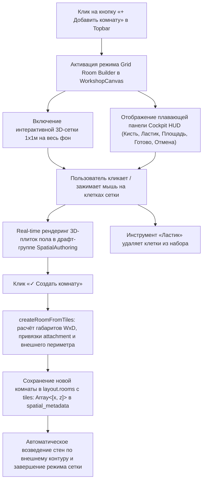

# Дизайн-документ: Интерактивный конструктор комнат по клеточкам (Cell-Grid Room Builder)

**Дата:** 2026-09-24  
**Статус:** Согласовано с пользователем, ожидает ревью спецификации  
**Ветка:** `test`  

---

## 1. Введение и цели
Пользователь запросил кардинальное улучшение процесса добавления комнат в 3D-мастерской:
- Добавление кнопки **«Добавить комнату»** прямо в верхней панели управления редактора.
- При нажатии весь тёмный фон вокруг существующих комнат переходит в режим интерактивной сетки с шагом $1 \times 1$ метр.
- Пользователь кликает (или зажимает мышь для рисования) по клеточкам, и в каждой выбранной клетке появляется полноценная 3D-плитка пола.
- Отдельный инструмент **«Ластик»** позволяет стирать ошибочно поставленные клеточки.
- Стены возводятся автоматически по внешнему периметру всех выбранных клеточек, позволяя создавать произвольные архитектурные формы (прямоугольные, Г-образные, Т-образные, с нишами).
- Данные сохраняются без поломки существующей схемы Supabase и без блокирующих миграций таблиц.

---

## 2. Архитектура и поток данных



---

## 3. Модель данных (`src/features/workshop/model.ts`)

### 3.1. Расширение интерфейса `Room`
```typescript
export interface Room {
  id: string;
  name: string;
  width: number;
  depth: number;
  attachment?: { roomId: string; side: RoomSide };
  labels?: RoomLabel[];
  camera?: { x: number; y: number; z: number; span: number; azimuth?: number; top?: boolean };
  // Координаты 1x1м плиток в мировых координатах сетки (целые числа в метрах)
  tiles?: Array<[number, number]>;
}
```

### 3.2. Алгоритм внешнего периметра стен (`roomPerimeterEdges`)
Для любого набора клеток `tiles`:
Для каждой клетки `(x, z)` в `tiles`:
- Проверяем 4 направления:
  - `north: (x, z - 1)`
  - `south: (x, z + 1)`
  - `east:  (x + 1, z)`
  - `west:  (x - 1, z)`
- Если в направлении соседняя клетка отсутствует в `tiles` и не граничит с открытым проходом смежной комнаты — эта грань является внешней стеной периметра.

### 3.3. Создание комнаты из набора клеток (`createRoomFromTiles`)
```typescript
export function createRoomFromTiles(
  state: Workshop,
  tiles: Array<[number, number]>,
  name?: string
): Workshop
```
- Валидация: `tiles.length >= 1`.
- Вычисление габаритов:
  - `minX = Math.min(...tiles.map(t => t[0]))`
  - `maxX = Math.max(...tiles.map(t => t[0])) + 1`
  - `minZ = Math.min(...tiles.map(t => t[1]))`
  - `maxZ = Math.max(...tiles.map(t => t[1])) + 1`
  - `width = Math.max(2, maxX - minX)`
  - `depth = Math.max(2, maxZ - minZ)`
- Определение привязки `attachment`:
  - Находим существующую комнату, с которой граничат новые плитки (или ближайшую комнату).
  - Задаём `attachment: { roomId: parent.id, side }`.
- Добавление комнаты в `state.rooms` с `tiles` и переключение активной комнаты.

---

## 4. Рендеринг 3D-сцены (`referenceSceneParts.ts` & `spatialAuthoring.ts`)

### 4.1. Модульный рендеринг пола и стен по плиткам (`referenceSceneParts.ts`)
- Если `room.tiles` задан:
  - Для каждой плитки `[tx, tz]` в `room.tiles` рендерится цокольный блок субпола (`[1.0, 0.34, 1.0]` на `y = -0.17`) и верхняя плита пола (`[1.0, 0.026, 1.0]`).
  - Для внешних граней периметра возводятся модульные стеновые панели высотой $2.6$ м, плинтусы и угловые пилоны.
- Если `room.tiles` отсутствует (прежние комнаты):
  - Сохраняется 100% обратная совместимость с генерацией прямоугольного пола $W \times D$.

### 4.2. Интерактивная сетка конструктора (`SpatialAuthoring`)
- При активации режима:
  - Добавляется глобальная плоскость сетки `gridBuilderPlane` размером $60 \times 60$ м с шагом $1.0$ м (тёмный графитовый фон `#090d16` со светящимися линиями `#1e293b` и `#38bdf8` на главных осях).
  - Под курсором мыши отображается `cellHoverMesh`:
    - Режим «Пол»: яркая голубая рамка (`#38bdf8`) с полупрозрачной плиткой-призраком.
    - Режим «Ластик»: предупреждающая красная рамка (`#ef4444`).
- При нажатии / движении с зажатой кнопкой мыши:
  - Режим «Пол»: клетка `(gx, gz)` добавляется в `draftTilesSet`. В 3D сразу появляется плитка пола.
  - Режим «Ластик»: клетка `(gx, gz)` удаляется из `draftTilesSet`, 3D-плитка исчезает.
  - Передаётся колбэк обновления счётчика площади в UI: `onDraftTilesChange(draftTiles.length)`.

---

## 5. Пользовательский интерфейс (UI)

### 5.1. Кнопка в верхней панели редактора (`WorkshopCanvas.tsx`)
- Кнопка **«+ Добавить комнату»** стилизована в едином дизайне Meridian Cockpit:
  - Акцентная янтарная подсветка.
  - Доступна в режиме редактирования.

### 5.2. Плавающий Cockpit HUD конструктора
При активном конструкторе внизу по центру отображается стильный плавающий пульт:
- Инструменты:
  - Кнопка `[ ✏ Добавить пол ]` (активна по умолчанию)
  - Кнопка `[ ⌫ Ластик ]` (стирание ошибочных плиток)
- Статус:
  - `Выбрано: {count} м² ({count} плиток)`
- Действия:
  - `[ ✓ Создать комнату ]` — валидирует и применяет комнату.
  - `[ ✕ Отмена ]` (или клавиша Esc) — сбрасывает драфт и выходит из режима.

---

## 6. Совместимость с базой данных (Supabase)
- В таблице `workshop_rooms` колонка `spatial_metadata` уже имеет тип `jsonb` со значением по умолчанию `'{}'::jsonb`.
- Свойство `tiles` упаковывается внутрь `spatial_metadata`, а колонки `width_m` и `depth_m` получают описывающий прямоугольник комнаты.
- Это полностью исключает необходимость блокирующих миграций БД и гарантирует моментальную работоспособность как в облаке, так и в `localStorage`.

---

## 7. План тестирования и проверок
1. **Юнит-тесты (`tests/workshop.test.ts`)**:
   - Тест на вычисление внешнего периметра `roomPerimeterEdges` для различных конфигураций (прямоугольник, Г-образная форма, Т-образная форма).
   - Тест на создание комнаты из набора клеток `createRoomFromTiles` с проверкой габаритов и привязки.
   - Тест на сохранение и чтение `tiles` через `parseWorkshop` и кэш.
2. **Прогоны проверок**:
   - `npx tsc --noEmit` — 0 ошибок типов.
   - `npm test` — все 209+ тестов проходят.
   - `npm run build` — успешная сборка приложения Next.js.
